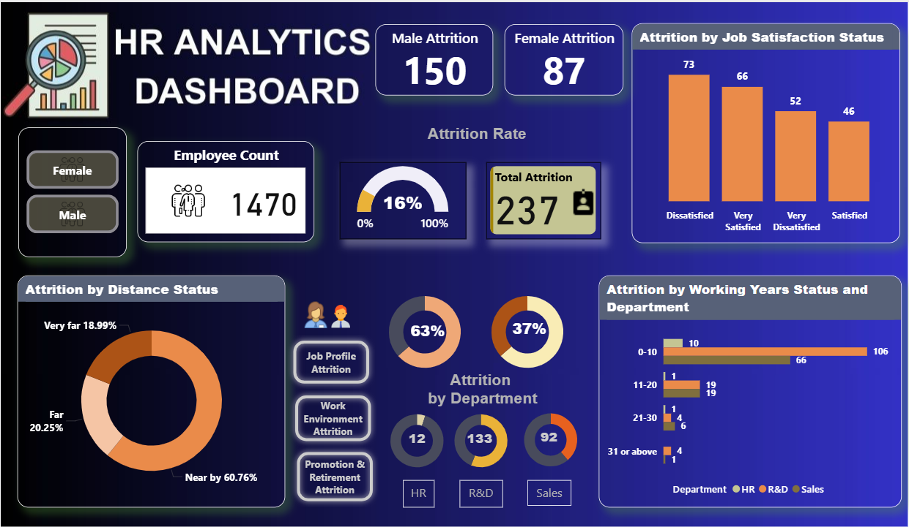
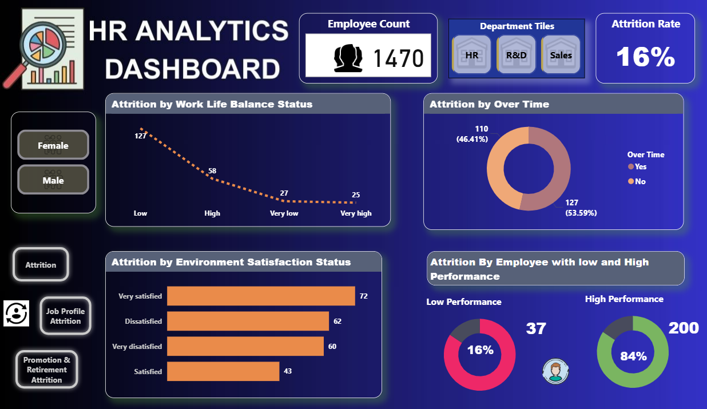
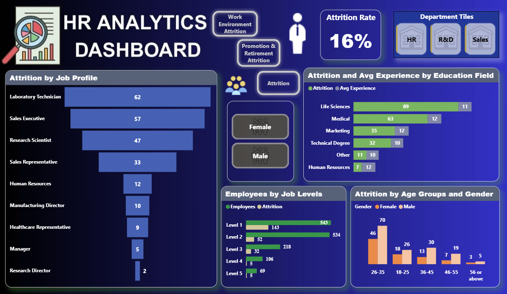
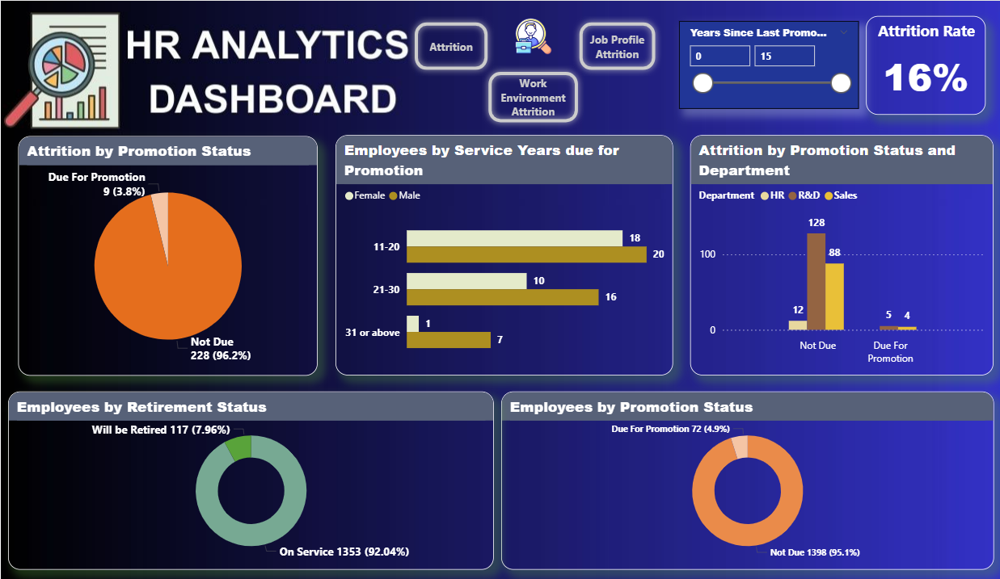

# 👥 HR Analytics Dashboard — Employee Attrition Analysis


> **4-page Power BI dashboard** analyzing employee attrition across 1,470 employees — built on a Star Schema with 25+ DAX measures to help HR leaders identify retention risks and make proactive workforce decisions.

---

## 📸 Dashboard

| Page | Preview |
|------|---------|
| Attrition Report |  |
| Work Environment |  |
| Job Profile |  |
| Promotion & Retirement |  |

---

## 📊 Key Metrics

| KPI | Value |
|-----|-------|
| Total Employees | **1,470** |
| Total Attrition | **237** |
| Attrition Rate | **16%** |
| Male Attrition | **150** |
| Female Attrition | **87** |
| Due For Promotion | **72 (4.9%)** |
| Will Be Retired | **117 (7.96%)** |

---

## 🗄️ Data Model — Star Schema

```
                    ┌─────────────────────┐
                    │  Fact_HR Attrition  │
                    │ ─────────────────── │
                    │  Employee Num  (FK) │
                    │  Department Id (FK) │
                    │  Attrition          │
                    │  Income             │
                    │  Job Satisfaction   │
                    │  Over Time          │
                    │  Performance Status │
                    │  Retirement Status  │
                    │  Work Life Balance  │
                    │  Service Years      │
                    └──────────┬──────────┘
           ┌───────────────────┼──────────────────┐
           │                   │                  │
  ┌────────┴───────┐  ┌────────┴───────┐  ┌──────┴──────────────┐
  │ Dim_Employees  │  │  Dim_Emp_Dept  │  │ Dim_Emp_Performance │
  │ Age / Gender   │  │ Department     │  │ Environment Sat.    │
  │ Education Field│  │ Job Role/Level │  │ Job Involvement     │
  │ Marital Status │  │ Promotion Status│  │ Relationship Sat.  │
  │ Working Years  │  │ Yrs Since Promo│  └─────────────────────┘
  └────────────────┘  └────────────────┘
           │
  ┌────────┴──────────────┐     ┌──────────────────┐
  │  Dim_Emp_Job_Status   │     │  Dim_Emp_Rating   │
  │ Business Travel       │     │ Daily Rate        │
  │ Distance From Home    │     │ Hourly Rate       │
  │ Salary Hike           │     │ Monthly Rate      │
  └───────────────────────┘     └──────────────────┘
```
## 🔍 Key Insights

| Area | Finding |
|------|---------|
| 🏢 Highest Dept | R&D — **133 attritions** |
| 👔 Highest Role | Laboratory Technician — **62** |
| 🎂 Peak Age Group | **26–35 years** (116 total) |
| 📊 Job Level Risk | **Level 1 = 143** attritions |
| ⚖️ Work-Life Balance | Low WLB = **127** attritions |
| ⏰ Overtime Effect | **53.59%** of attrition work overtime |
| 🏆 Performance Paradox | High performers = **84%** of attrition |
| 🎓 Education | Life Sciences = **89** attritions |

---

## 📁 Files

| File | Description |
|------|-------------|
| `HR_Analytics_Dashboard.pbix` | Power BI dashboard — 4 pages |
| `HR_Employee_Attrition.xlsx` | Source dataset — 1,470 records |
| `images/` | Dashboard screenshots (all 4 pages) |

---

## 🚀 Getting Started

```
1. Download HR_Analytics_Dashboard.pbix
2. Open in Power BI Desktop (free)
3. Navigate 4 pages via bottom tabs:
   → Attrition Report
   → Work Environment Attrition
   → Job Profile Attrition
   → Promotion and Retirement Attrition
4. Filter by Department: HR | R&D | Sales
5. Toggle Male / Female using gender buttons
```

---

## 🔗 Connect

[](https://linkedin.com/in/saksham-agarwal-1308)
[](mailto:saksham.agrwl@gmail.com)
[](https://github.com/saksham1308)

---
<div align="center">⭐ Star this repo if you found it useful!</div>
